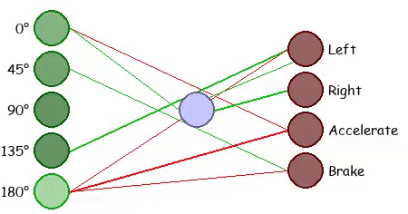
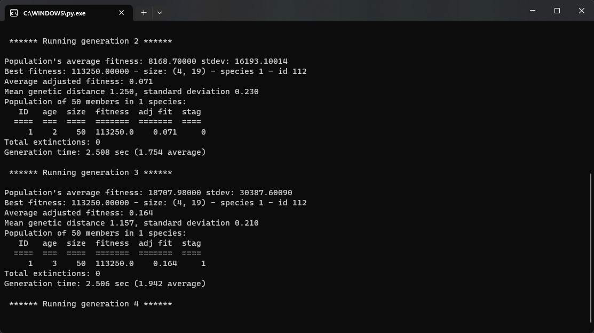
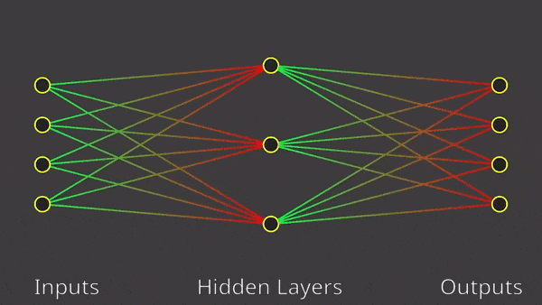
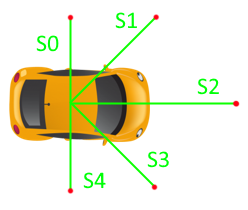
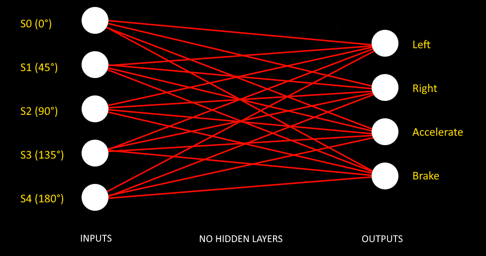

# Neat Cars

## 📝 Description

Neat cars allows you to draw a track, a starting point and then let the magic happen. The cars will drive themselves and constantly improve their driving skills. The project is based on a genetic algorithm called [NEAT (NeuroEvolution of Augmenting Topologies)](https://en.wikipedia.org/wiki/Neuroevolution_of_augmenting_topologies).

## 🎥 Demo

### Live neural network in the top left corner



### Track 1: With sensors - Infinite track

https://user-images.githubusercontent.com/52708150/223087114-7d4e0401-bb33-46fd-9673-bd973de7235f.mp4

### Track 2: Without sensors - Finite track

https://user-images.githubusercontent.com/52708150/223087098-0bd16d36-cef2-4773-b657-5471fa1f5baa.mp4


## 💡 How to use

### Prerequisites

* Python 3.7.0+

Get a copy of the Project. Assuming you have git installed, open your Terminal and enter:

```bash
git clone 'https://github.com/marcpinet/neat-cars.git'
```

To install all needed requirements run the following command in the project directory:

```bash
pip install -r requirements.txt
```

### Running

After that, you can proceed to start the program by running `main.py`.

### Controls and tweaks

Instructions are displayed in the window's title.


You can also see the stats of the current generation in the title...


...and the full stats inside the console.



Feel free to tweak the parameters inside the `ai/config.txt` but also the static variables inside the `Car`, `CarAI` and `Engine` classes.
For example, you can disable the rendering of the car's sensors by setting `DRAW_SENSORS` to `False` in the `Car` class.

## ⚙️ How the AI works

The neural network is trained using the NEAT algorithm. The NEAT algorithm is a genetic algorithm which evolves over time from a basic neural network to a more advanced and complex one *depending on your fitness function* by going further and further. Check the [neat-python documentation](https://neat-python.readthedocs.io/en/latest/neat_overview.html) for more infos.



Also, you can find the full mathematic approach and details directly in the [NEAT paper](https://nn.cs.utexas.edu/downloads/papers/stanley.ec02.pdf).

### Inputs

The main informations the car will use to drive are the distance to the walls in front and next of it. The car has 5 sensors :

- In front,
- 2 in the diagonals
- 2 on each side

The sensors are represented by a green line in the rendering. Red means the sensor is detecting a wall.

[](https://marcpinet.me)

### Outputs

The outputs are obviously the car's actions. The car has 4 possible actions:

- Turn left
- Turn right
- Accelerate
- Brake

Note that we have a minimum speed to respect so that the car doesn't stop completely nor drives too slowly.

We get, as a starting point for our neural network, something like this:



### Fitness

The fitness is quite simple: the more the car drives, the better it is. The fitness is calculated by the distance the car has driven. The car is therefore penalized if it crashes.

## 🐛 Known issues

* The cars can get stuck in an infinite turn (the algorithm will still fixes itself while evolving tho)

## 🥅 TO-DO List

* Find a way to allow 8-like tracks
* Make the reward system more complex
* Make a detailed article at [marcpinet.me](https://marcpinet.me)

## ✍️ Authors

* **Marc Pinet** - *Initial work* - [marcpinet](https://github.com/marcpinet)

## 📃 License

This project is licensed under the MIT License - see the [LICENSE.md](LICENSE.md) file for details
